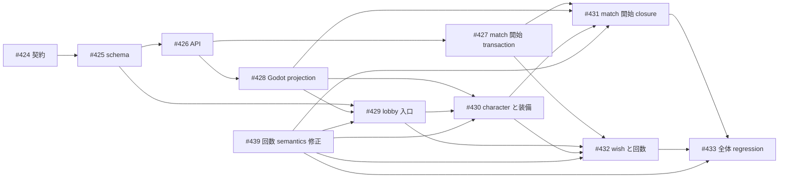
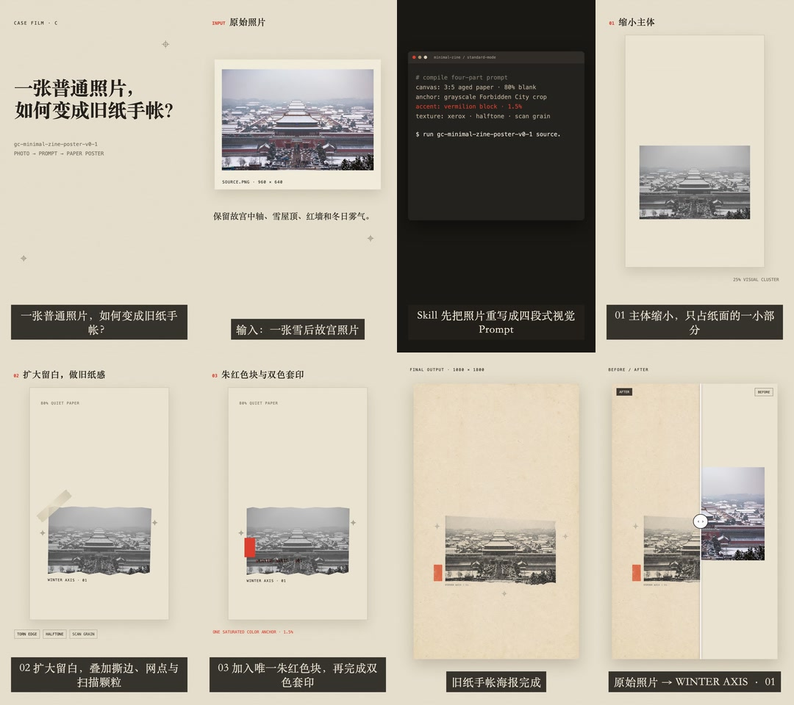

<div align="center">

# Akasha Grimoire · アカシャ秘典

**一度の成功した Agent 協働を、チームが繰り返し使える能力へ。**

[](#スキル一覧)
[](#graph-engineering)
[](#)
[](#利用する理由)
[](LICENSE)

[简体中文](README.zh-CN.md) · [English](README.md) · **日本語**

</div>

---

Akasha Grimoire は、**Codex App** での利用に最適な、チーム共有の Agent Skill コレクションです。タスク境界、ツールの事実、実行スクリプト、低ノイズな待機、独立した受け入れ確認をインストール可能な能力としてまとめ、実プロジェクトで Agent の推測や反復ポーリングを減らし、証拠に基づく納品を実現します。個別の Skill は、ほかの互換 Agent や CLI でも利用できます。

> **画像・動画・音声・音楽の生成をすぐに試したい場合：** [LovBrowser](https://lovbrowser.com) でアカウントを登録し、クレジットを追加してください。Akasha Grimoire は既定で `https://newapi.1234bot.com/v1` に接続します。1 つの new-api Key で GPT Image、Grok、Seedance、MiniMax H3、Kling、Gemini Omni、Fish Audio、Suno を利用でき、サービスごとの Base URL 設定は不要です。

## 1 分で利用開始

1. Codex で GPT Image、Grok、Seedance、MiniMax H3、Kling、Gemini Omni、Fish Audio、Suno にメディア処理を直接依頼します。
2. 初回利用時に Key がなければ、Agent が LovBrowser のデバイス認証 QR コード、クリック可能なリンク、短いコードを生成します。
3. スマートフォンでスキャンし、登録またはログインして同じ短いコードを確認します。ローカルクライアントが自動でポーリングし、認証情報を保存して `/v1/models` で検証します。
4. 検証後、元のメディア処理が一度だけ自動で再開されます。実際の Key は会話、クリップボード、コマンド引数を通りません。

`python3 shared/akasha_credentials.py status|start|finish|cancel|rollback` を実行して設定を管理することもできます。認証情報は既定で `~/.config/akasha/credentials.env` に保存されます。既存の環境変数も引き続き利用でき、優先順位は専用変数 > `NEW_API_API_KEY` > ユーザー認証情報 > `OPENAI_API_KEY` です。

## 利用する理由

- **契約を先に定義**：実行前にトリガー、入力、出力、禁止事項、完了条件を明確にします。
- **事実に基づく**：CLI のバージョン、引数、エンドポイント、制約は、現在の実行環境と信頼できる実装に照らして確認します。
- **低ノイズ実行**：定型ポーリングや機械的な処理はスクリプトに任せ、token を判断と Review に残します。
- **独立した受け入れ確認**：worker の自己申告ではなく、累積 diff、テスト、成果物、リモート状態の検証を根拠にします。
- **唯一の情報源**：共有 Skill の正本はリポジトリとし、ローカルにはシンボリックリンクで導入します。

## Graph Engineering

Graph Engineering は、納品を一時的な prompt の列ではなく、追跡可能な作業グラフとしてモデル化します。

`Spec → Epic → Issue → Agent Task → Evidence`

| 階層 | 責務 |
| --- | --- |
| **Spec** | 目標、境界、非対象、重要な判断、最終受け入れ条件を定義するルート契約 |
| **Epic** | Spec をマイルストーンのサブグラフへ分解し、Issue 間の依存と集約受け入れを整理 |
| **Issue** | owner、範囲、依存、出力、検証を持つ最小実行ノード |
| **Agent Task** | Codex App または外部 worker における Issue の実行インスタンス。Issue の記録を置き換えない |
| **Evidence** | diff、テスト、成果物、Review、リモート SHA で Issue を閉じ、Epic と Spec へ完了を集約 |

実装と受け入れ確認が必要な作業はすべて Issue 駆動です。各 task を Issue に対応付け、依存関係は `depends_on`、`blocks`、`produces`、`validates` の edge で表し、依存が満たされた node だけを並列実行します。方向変更では先に Spec/Epic/Issue を更新し、完了は Evidence で末端から上位へ集約します。Codex App は task の表示、分離 worktree、長時間の境界付き待機、受け入れループを扱えるため、この方法の推奨 control plane です。

## スキル一覧

リポジトリには現在 **28 個の Skill** があります。1 つだけ導入することも、コンテンツ理解、メディア生成、編集 QA、マルチ Agent 開発、配信までを一体化したパイプラインとして組み合わせることもできます。

### 最近の更新

- **コンテンツの並列配信**：`multi-platform-video-publishing` が Douyin、小紅書、Bilibili、WeChat Channels のアカウント確認、プラットフォーム別コピー、アップロード、台帳、リモート検証を統合しました。
- **イベント駆動のマルチ Agent**：`agent-task-supervisor` と `codex-app-development` を二層構造に統一しました。分離 worker は完了順に受け入れ、監督 task が diff を独立 Review してリスクベースの検証を再実行します。
- **GitHub 非同期パイプライン**：`github-issue-pipeline` が Issue、label、comment、PR を通じて要件、開発、Review の三つの非同期役割を接続します。
- **UI ベンチマークと視覚的収束**：`ui-ux-imitation-development` が同一 viewport の screenshot、半透明 overlay、差分 hotspot で UI 修正を駆動します。
- **動画機能の拡張**：Gemini Omni 動画編集、Seedance の最終フレーム継続、H3/Kling ゲーム PV、WeChat Channels の talking-head 編集、秒単位の演出 prompt を追加・強化しました。
- **Remotion 完成版 engine**：`remotion-video-production` が video-shotcraft の shot recipe、正確な Demo、追跡可能な SFX manifest、決定論的 render、独立した最終 Review を標準化します。

### 認証情報と入口

| Skill | 主な用途 | 中核機能 |
| --- | --- | --- |
| [`akasha-key-setup`](skills/akasha-key-setup/) | メディア Skill の初回利用または new-api 認証情報の管理 | LovBrowser デバイス認証、Key のローカル保存、接続検証、キャンセル、rollback |

### 協働とガバナンス

| Skill | 主な用途 | 中核機能 |
| --- | --- | --- |
| [`agent-task-supervisor`](skills/agent-task-supervisor/) | Spec/Epic/Issue グラフで複数 task を監督 | 二層 task 構造、依存スケジューリング、分離 worker、task ごとの cursor、完了順受け入れ、独立 Evidence 検証 |
| [`github-issue-pipeline`](skills/github-issue-pipeline/) | GitHub で複数 task の開発を非同期に推進 | Epic/Issue 作成、ready Issue の派遣、PR Review、label/comment 状態機械、merge 完了処理 |

### コンテンツ制作

| Skill | 主な用途 | 中核機能 |
| --- | --- | --- |
| [`content-pipeline`](skills/content-pipeline/) | 中国語のアイデア、記事、資料から小紅書形式の画像投稿パッケージを制作 | コンテンツ契約、出典調査、コピー、内容 map、HTML/CSS card、必要時の画像生成、モバイル QA |

`content-pipeline` 単体でテキスト中心の HTML/CSS card を制作できます。写真やイラストを生成する場合は、`gpt-image-generation` と `akasha-key-setup` も導入してください。

### 動画制作

| Skill | 主な用途 | 中核機能 |
| --- | --- | --- |
| [`video-production`](skills/video-production/) | アイデア、記事、脚本、既存素材から完成動画を制作 | Remotion または動画 model を先に選び、演出、素材、完成版、QA を統括 |
| [`remotion-video-production`](skills/remotion-video-production/) | code animation、interface demo、写真/コピー構成、復元可能な Remotion 動画 | video-shotcraft shot recipe、正確な Demo、必要時の SFX、二版 render、専門受け入れ確認 |
| [`video-director`](skills/video-director/) | 脚本、演出、絵コンテ、生成前計画 | narrative beat、shot coverage、camera movement、continuity bible、生成計画 |
| [`video-source-research`](skills/video-source-research/) | B-roll、画像、音声の検索、取得、整理 | shot ごとの検索、download、ffprobe、SHA-256、追跡可能な `sources.json` |
| [`video-editing`](skills/video-editing/) | 一般的な rough/fine cut、B-roll、音声、字幕、書き出し | Review 可能な `edl.json`、決定論的 FFmpeg render、音画同期、複数 aspect の export |
| [`video-qc`](skills/video-qc/) | 生成 clip、preview、完成動画の受け入れ確認 | 全体 decode、黒画面/freeze/silence/loudness/subtitle 検査、代表 frame、連続性 Review |
| [`wechat-channels-talking-head`](skills/wechat-channels-talking-head/) | WeChat Channels の口播、interview、解説動画を編集 | 意味ベースの rough cut、最終音声からの単語単位字幕、info card/PiP、cover、配信 package、過剰編集防止の再検証 |
| [`article-to-short-video`](skills/article-to-short-video/) | 中国語の長文記事や論説を 60〜120 秒の縦型動画へ変換 | 証拠境界、narration 圧縮、dynamic shot、Fish voiceover、Suno music、縦型動画の受け入れ確認 |
| [`seedance-video-generation`](skills/seedance-video-generation/) | Seedance の text-to-video、image-to-video、first/last-frame、multi-reference 生成 | 秒単位の演出 prompt、model-level 制約、非同期 polling、安全な download、出力 probe |
| [`seedance-video-continuation`](skills/seedance-video-continuation/) | 既存 MP4 の最終 frame から続きを生成 | 最後の有効 frame 抽出、first-frame continuation、連続性 prompt、segment 結合、再検証 |
| [`h3-kling-video-generation`](skills/h3-kling-video-generation/) | MiniMax H3、Kling の shot とゲーム PV | T2V/I2V、director-style prompt、2D animation/MG/UI 合成、model 検証、MP4 download |
| [`gemini-omni-video-generation`](skills/gemini-omni-video-generation/) | Gemini Omni の動画生成と編集 | 公開素材や過去 task からの継続、job polling、MP4 検証、予期しない音声の診断 |
| [`multi-platform-video-publishing`](skills/multi-platform-video-publishing/) | 受け入れ済み動画を四つのプラットフォームへ配信 | 並列 account check/upload、プラットフォーム別コピー、SHA 重複防止、台帳、remote status 検証、復旧 |

完成版 engine が指定されていない場合、`video-production` は Remotion と動画 model のどちらを使うか先に確認します。Remotion、video-shotcraft、具体的な動画 model が明示されていれば、その route に直接入ります。動画 model route は shot の要件に応じて H3、Grok、Seedance を選びます。静止画、narration、music はそれぞれ GPT Image、Fish Audio、Suno へ振り分けます。Web 動画の取得には追加で `yt-dlp`、決定論的な編集と QA には FFmpeg/ffprobe、正式配信にはログイン済みの `mpau` runtime が必要です。

### 画像・ゲーム・音声

| Skill | 主な用途 | 中核機能 |
| --- | --- | --- |
| [`game-asset-forge`](skills/game-asset-forge/) | キャラクター、scene、UI、icon、tileset、sprite、animation frame | asset 契約、batch 前の smoke、alpha/halo 検査、character 一貫性、animation loop、engine import の受け入れ確認 |
| [`gpt-image-generation`](skills/gpt-image-generation/) | GPT Image または Gemini の参照画像による生成・編集 | generations/edits、multi-reference 合成、安全な保存、実 format/dimension 検証、endpoint 診断 |
| [`grok-media-generation`](skills/grok-media-generation/) | Grok の画像・動画生成と編集 | stable/preview endpoint、画像編集、video job polling、結果解析、実 file の受け入れ確認 |
| [`fish-audio-speech`](skills/fish-audio-speech/) | TTS、STT、voice 検索/cloning、character voice | public/private voice、感情制御、character ごとの binding、timestamp 付き転記、音声保存 |
| [`suno-music-generation`](skills/suno-music-generation/) | song、lyrics、instrumental music | 非同期 job、ローカルでの無出力 polling、複数候補の音声/cover download、項目別受け入れ確認 |

### App サブ task と CLI 開発 worker

コード開発では、既定で二層 loop を使います。**監督 task が要件契約と受け入れ条件を定義 → 分離 Codex App worker が自律的に計画し、TDD で実装して自己テスト → 監督 task が累積 diff を独立 Review し、リスクベースの検証を再実行して Git 納品を完了**。並列 worker は分離 worktree と task ごとの cursor を使い、それぞれが完了した時点ですぐ受け入れ、同じ batch の残りを待ちません。ユーザーが CLI TUI worker を明示した場合に限り、Epic 監督 → Issue 担当/受け入れ → CLI developer の三層へ切り替えます。

| Skill | Worker / 用途 | 特徴 |
| --- | --- | --- |
| [`codex-app-development`](skills/codex-app-development/) | 既定のコード開発 worker | GPT-5.6 Sol、難易度別 thinking、分離 worktree、Red → Green → Refactor、独立 diff Review |
| [`claude-code-cli-development`](skills/claude-code-cli-development/) | ユーザーが Claude Code を指定 | 可視 Terminal + tmux、status/delivery file、同一 session での再作業、親 task の受け入れ確認 |
| [`codex-cli-development`](skills/codex-cli-development/) | ユーザーが Codex CLI/TUI を指定 | 単一の対話 session における計画、Red gate、実装、Review、再作業 |
| [`gemini-cli-development`](skills/gemini-cli-development/) | ユーザーが Gemini CLI を指定 | frontend と一般開発、可視 TUI、status 納品、独立受け入れ確認 |
| [`grok-cli-development`](skills/grok-cli-development/) | ユーザーが Grok CLI を指定 | 境界が明確な小規模 code/UI task と visual/video concept |
| [`ui-ux-imitation-development`](skills/ui-ux-imitation-development/) | 既存 UI を参照 product に合わせる | 同一 viewport の参照/現状 screenshot、overlay 差分、範囲確認、修正、screenshot 再検証 |

## ケース 1：`lov-talk`——6 分の気軽な口播を配信可能な動画へ

「Cross-Session Communication and Agent Workflows」は、表示が 90° 回転したスマートフォン素材から始まりました。Agent はまず意味 map を作り、365.424 秒の素材を 309.566 秒へ圧縮しました。silence で機械的に切るのではなく、「新機能 → 従来の問題 → Goal mode の反例 → 三 Agent workflow → 生産能力の結論」という論証全体を保持しています。

[](docs/assets/lov-talk-agent-workflow-preview.mp4)

[▶ 32 秒の talking-head 編集 preview を再生または download](docs/assets/lov-talk-agent-workflow-preview.mp4)（冒頭、Goal mode、三 Agent workflow、生産能力の結論から各 8 秒。完成版の音声を保持）

| 工程 | 使用した能力 | 再検証可能な結果 |
| --- | --- | --- |
| 意味編集 | `wechat-channels-talking-head` + `video-editing` | 1 本の全長 baseline clip を 39 個の意味 clip へ変換し、`cut-plan.csv`、`edl.json`、適用可能な patch を出力 |
| 情報強化 | `wechat-channels-talking-head` | 話者の主画面と字幕 safe area を保った 7 枚の解説 info card |
| 字幕と音声 | 最終 A-roll 音声との整合 + FFmpeg | 75 個の単語単位字幕と dialogue-sidechain music。重複、負の duration、範囲外 cue はゼロ |
| 完成版受け入れ | `video-qc` | 1080 × 1920、30 fps、H.264/AAC。全体 decode 成功、-15.69 LUFS、True Peak -0.98 dBTP |
| 復元可能な納品 | Patch + rollback + SHA-256 | 修正版を再構築可能。rollback copy の hash は原本と一致 |

このケースから得られた重要な規則は、**意味と最終音声を固定してから、字幕と視覚的な強化を追加する**ことです。そうしなければ字幕が中間版に伴ってずれたり、「テンポを速くする」ために論証に必要な文脈を切り落としたりします。

## ケース 2：`lov-anime`——75 秒の 2D アニメーション「履卦・回身」

アニメーション制作は「1 本の Prompt で完成」ではありません。`lov-anime` はまず内容契約と視覚契約を固定し、character/scene anchor と難しい shot の smoke を受け入れてから、統一 style の 6 segment を batch 生成し、最後に Fish Audio の女性 narration、Suno music、字幕、mix、配信 package を完成させました。

[](docs/assets/lov-anime-lugua-75s-preview.mp4)

[▶ 「履卦・回身」75 秒の圧縮 preview 全編を再生または download](docs/assets/lov-anime-lugua-75s-preview.mp4)（540 × 960、24 fps、H.264/AAC、女性 narration と music を保持）

| 工程 | 使用した能力 | 再検証可能な結果 |
| --- | --- | --- |
| 演出と一貫性 | `video-director` + `h3-kling-video-generation` | 内容/視覚契約、6 segment の演出計画、anchor と難しい shot の smoke、shot ごとの QA |
| 音声と音楽 | `fish-audio-speech` + `suno-music-generation` | 独立した女性 narration、instrumental BGM、voice 選択記録、候補受け入れ |
| 編集と mix | `video-editing` | 2.5 kHz を常時 1.5 dB carve。music は narration に合わせて dynamic ducking せず、dialogue は明瞭 |
| 完成版受け入れ | `video-qc` | 75 秒、1080 × 1920、24 fps、1,800 frame。-16.0 LUFS、True Peak -2.0 dBFS、全体 decode 成功、黒 frame 0 |
| 配信 package と fallback | `video-editing` + 実行可能な rollback | 2 種類の cover、字幕、manifest、SHA-256、配信コピー、実行可能な rollback。受け入れ後は四 platform 配信へ移行可能 |

この workflow は、教育アニメーション、ブランド短編、AI MV に適しています。最小限の smoke で character drift、制御困難な shot、audio masking を露出させてから生成規模を拡大します。

## ケース 3：`mahjong-game`——Issue グラフでマルチ Agent 開発を調整

[Mahjong King](https://github.com/lov-team/mahjong-game) は、大規模 Godot project を `Spec → Epic → Issue → Agent Task → Evidence` に分解します。E10「個人 space、inventory、match loadout」では、[#424](https://github.com/lov-team/mahjong-game/issues/424)〜[#433](https://github.com/lov-team/mahjong-game/issues/433) が product 契約、schema、control-plane API、match 開始時の回数減算 transaction、Godot projection、lobby/character page、全体 regression の有向非巡回 graph を構成します。これらの leaf Issue は 2026-08-06 から 2026-08-09 にかけて順次完了しました。



マルチ Agent 協働は「多くの chat window を同時に開く」ことではありません。次の四つのスケジューリング制約に従います。

1. `agent-task-supervisor` は hard dependency が満たされた ready Issue だけを開始し、派遣前に file-level の soft conflict を除外します。
2. 各 `codex-app-development` worker は分離 task/worktree を使い、計画、TDD、実装、自己テストを自律的に完了します。
3. 複数 worker は task ごとの cursor で待機し、最初に完了したものから Review します。batch polling は行わず、速い task を遅い task のために待たせません。
4. 親 task は worker の自己申告を証拠として採用せず、累積 diff、テスト、成果物、PR、remote SHA を独立して確認します。P0〜P2 の指摘は元の worker に返して再作業させます。

E11「共有 charge meter と ultimate move」は fork/join をさらに示します。[#449](https://github.com/lov-team/mahjong-game/issues/449) が #450/#451 を同時に解放し、その後 energy、protocol、item、12 character の ability を並列で進め、最後に HUD、AI/simulation、[#460 全体受け入れ](https://github.com/lov-team/mahjong-game/issues/460) で合流します。この pattern は frontend、backend、protocol、content、QA にまたがる長期 project に適しています。

## ケーススタディ4：雪の故宮・古紙手帳——Remotion で画像ワークフローを動画化

「一枚の普通の写真は、どうすれば古紙の手帳ページになるのか？」このケースでは、雪の故宮写真が古紙ポスターへ変化する過程を、元画像の登場、Prompt の組み立て、主題の縮小、余白の拡大、紙の経年加工、朱赤の版ずれ、完成版の提示、Before/After という八つの読み取れる段階に分けています。`remotion-video-production` が操作ロジック、ショット、字幕、サウンドを、再現可能な35秒の縦型 Case Film にまとめます。

[](docs/assets/snowy-forbidden-city-remotion-case-sfx-preview.mp4)

公開プレビューは SFX のみの版です。540 × 960、30 fps、H.264/AAC で、タイプ音、紙、版ずれ、スライダーの効果音を残しています。

| 工程 | 使用する能力 | 再検証できる結果 |
| --- | --- | --- |
| 物語と timeline | `video-director` + `remotion-video-production` | 8 scene が frame 0–1049 を連続して覆い、各 scene は一つの視覚変化だけを説明します |
| ショット設計 | Remotion の motion choreography | terminal の逐字入力、紙片の固定、二色の版ずれ、Before/After slider をコードで frame 単位に制御します |
| 決定論的 animation | Remotion の frame 計算 | 1080 × 1920、30 fps、1050 frame。source code は実時間の日付や非決定論的な乱数に依存しません |
| sound design | 追跡可能な6個の SFX | タイプ音、return bell、紙の slide、裁断、固定、quick sweep を scene 開始 frame からの offset で固定します |
| 成片の受け入れ | `video-qc` | 公開するのは SFX のみの1版。完全 decode、1050 frame の連続性、black frame 0 を確認しています |

このケースから得られた重要な原則は、**Remotion が素材の変化を理解できる形で伝えること**です。素材は画像生成、動画 model、screenshot、user file から受け取れます。timeline に入った後は、shot、字幕、sound、parameter、QA が決定可能で、検査でき、再構築できます。

## 小規模ケース：画像・動画・音声・音楽の生成

| 目的 | Skill の組み合わせ | 完了済みの例 |
| --- | --- | --- |
| 画像生成・編集 | `gpt-image-generation` / `grok-media-generation` + `game-asset-forge` | [Mahjong King #230](https://github.com/lov-team/mahjong-game/issues/230) で 12 人の original character の brief と小規模 sample batch を確認してから portrait を一括生成し、Godot import、12 個の `portrait_path`、serialization、旧 IP の negative audit を検証 |
| 動画生成 | `seedance-video-generation` + `seedance-video-continuation` | [60 秒「一枚の卵を支えるチーム」](docs/cases/fanjingshan-eggs-behind-team.md) は 15 秒 × 4 本の Seedance 2.0 縦型 animation を組み合わせ、実際の末尾 video と前景の遮蔽で連続性を維持 |
| 音声生成 | `fish-audio-speech` | 「履卦・回身」の中国語女性 voice を選び、分割 TTS を生成して 75 秒の narration を合成し、STT/CER を併用した聞き返しで明瞭度を確認 |
| 歌・音楽生成 | `suno-music-generation` | 「回身」の song と instrumental BGM を生成し、download した各候補に ffprobe、全体 decode、loudness、silence、SHA-256 の受け入れ確認を実施 |


[](docs/assets/fanjingshan-eggs-behind-team-60s.mp4)

[▶ 60 秒「一枚の卵を支えるチーム」を再生または download](docs/assets/fanjingshan-eggs-behind-team-60s.mp4)

メディア生成に共通する規則は、**batch 前に 1 件を smoke する。download 前に raw response と task ID を保存する。最後に API の「success」を納品とみなさず、実 file を確認する**ことです。

## クイックインストール

リポジトリを clone した後もリポジトリを唯一の情報源として維持するため、シンボリックリンクでの導入を推奨します。

```bash
git clone git@github.com:lov-team/akasha-grimoire.git
cd akasha-grimoire
```

1 つの Skill を導入：

```bash
skill_name="suno-music-generation"
skills_home="${CODEX_HOME:-$HOME/.codex}/skills"
mkdir -p "$skills_home"
ln -s "$PWD/skills/$skill_name" "$skills_home/$skill_name"
```

既存の対象を保持しながら全 Skill を導入：

```bash
skills_home="${CODEX_HOME:-$HOME/.codex}/skills"
mkdir -p "$skills_home"

for skill_dir in "$PWD"/skills/*; do
  skill_name="$(basename "$skill_dir")"
  target="$skills_home/$skill_name"
  if [ -e "$target" ] || [ -L "$target" ]; then
    echo "既存の対象を保持：$target"
  else
    ln -s "$skill_dir" "$target"
  fi
done
```

既存対象を強制上書きしないでください。先に差分を監査し、不明な内容は復元可能な形で保持します。

## 使用例

Codex で Skill を直接指定します。

```text
$agent-task-supervisor を使ってこれらの task を低ノイズで監督し、納品後に独立して受け入れ確認してください。

$agent-task-supervisor を使ってこの Spec を Epic/Issue の依存 graph に分解し、Codex App では ready Issue だけを開始し、Evidence で graph 全体を末端から閉じてください。

$codex-app-development を使って GPT-5.6 Sol・task 難易度別 thinking の分離 worker を作成してください。worker に自律的な計画、TDD 実装、自己テストを任せ、現在の task が累積 diff を独立 Review して P0〜P2 の指摘を元 session に返してください。

$github-issue-pipeline を使ってこの Epic を依存関係付き GitHub Issue に分解し、ready Issue を定期的に派遣し、対応する PR を受け入れた後に merge して Issue を閉じてください。

$content-pipeline を使ってこの中国語記事を小紅書の画像投稿 set に変換し、原意を保持し、先に cover の方向性を確認して、復元可能な local package を納品してください。

$video-production を使ってこの製品アイデアを 30 秒の縦型動画にしてください。制作 route は未指定なので、最初に Remotion と動画 model のどちらを使うか確認してください。

$remotion-video-production と内蔵 video-shotcraft recipe を使い、この写真と字幕を 30 秒の縦型動画にして、復元可能な project、音声 2 version、keyframe、QA を納品してください。

$wechat-channels-talking-head を使ってこのスマートフォン口播を WeChat Channels 動画に編集してください。先に意味 map と過剰編集防止の rough cut を作り、最終音声から字幕、info card、cover、配信 package を生成してください。

$seedance-video-continuation を使ってこの MP4 の最後の有効 frame から次の segment を生成し、character、scene、camera direction を維持し、結合後に seam を再検証してください。

$video-source-research を使ってこの shot list 用の B-roll を検索し、採用 asset を download して、ffprobe metadata と SHA-256 を含む sources.json を出力してください。

$game-asset-forge を使って 2D ゲーム用の透明背景 character animation frame を作り、最初に 1 件 smoke してから batch 生成してください。

$grok-media-generation を使ってこの画像/動画を生成または編集し、download した実 file を受け入れ確認してください。

$suno-music-generation を使ってこの song description から music を生成し、すべての候補を download してください。

$fish-audio-speech を使ってこの narration を音声化し、冒頭、中盤、末尾を確認してください。

$multi-platform-video-publishing を使って受け入れ済み animation を Douyin、小紅書、Bilibili、WeChat Channels へ配信してください。platform ごとにコピーを調整し、台帳を保存して remote status を確認してください。

$ui-ux-imitation-development を使って現在の interface をこの参照画像に合わせてください。同じ viewport で screenshot を撮り、overlay 差分を分析し、修正後に再度 screenshot で収束を検証してください。
```

## 認証情報と実行環境

| 能力 | 設定元 | 契約 |
| --- | --- | --- |
| 既定 new-api | `https://newapi.1234bot.com/v1` | Base URL の設定は不要。recharge ticket の署名は公式入口 `llmapi.lovbrowser.com` と `llmapi-direct.lovbrowser.com` にも対応。private deployment の場合だけ `NEW_API_BASE_URL` または `--base-url` で上書き |
| GPT Image | `IMAGE_PROXY_API_KEY`、`NEW_API_API_KEY`、`OPENAI_API_KEY` | Key を command argument、prompt、log、repository に保存しない |
| Grok / Seedance / H3 / Kling / Gemini Omni | 専用 Key、`NEW_API_API_KEY`、`OPENAI_API_KEY` | 実際の呼び出しは課金対象。task を拡大する前に 1 件 smoke を実行 |
| Suno / Fish Audio | `NEW_API_API_KEY` または `OPENAI_API_KEY` | 実際の呼び出しは credit を消費。基本 test では外部 service を呼び出さない |
| 公式の自主／残高不足 recharge | `python3 shared/akasha_recharge.py` で payment session を作成し、LovBrowser page で金額を選択 | 自主 recharge に残高不足は不要。公式 new-api のみ。Agent はクリック可能な `publicPageUrl` だけを返し、QR code は表示せず、Key/ticket を漏らさない |
| Codex App 二層 task | 監督 task と、難易度別 thinking の分離 Sol worker task/worktree | 監督が契約を送信。worker が自律的に計画・実装。監督が full diff を独立受け入れ。CLI TUI worker だけは三層を維持 |
| CLI worker | 対応するローカル CLI、macOS Terminal、tmux | 初回利用時または version 変更後に `--version` と `--help` を再確認 |
| 動画編集と素材取得 | FFmpeg/ffprobe。Web download には追加で yt-dlp | macOS では `brew install ffmpeg yt-dlp` を使用。download 後も media を probe し、source と hash を記録 |

## 検証

各 Skill には標準 frontmatter と `agents/openai.yaml` があります。変更後、最低限次を実行します。

```bash
validator="${CODEX_HOME:-$HOME/.codex}/skills/.system/skill-creator/scripts/quick_validate.py"
for skill_dir in skills/*; do
  python3 "$validator" "$skill_dir"
done

git diff --check
```

新しい script には構文検査と副作用のない動作 test も必要です。画像、音楽、音声、動画、外部書き込みでは、local fake service または限定的な smoke test から始めます。end-to-end で検証していない能力は明示してください。

## 構成とメンテナンス

```text
skills/<skill-name>/
├── SKILL.md              # trigger の説明と中核作業契約
├── agents/openai.yaml    # Agent UI metadata
├── scripts/              # 反復可能で決定論的な実行 logic（任意）
├── references/           # tool の事実と専門契約（任意）
└── assets/               # 成果物へコピーする template と resource（任意）
```

- Skill 本文は簡潔に保ち、複雑な事実は一階層下の `references/` で段階的に開示します。
- Skill directory に README、changelog、cache、作業過程のまとめを追加しません。
- CLI/API 契約を変更したときは、実際の version、help、schema、信頼できる実装を再確認します。
- 正式納品前に累積 diff を読み、TODO、認証情報、ローカル絶対 path、cache、生成物を検査します。
- push 後に local SHA、remote SHA、重要 file の内容を照合します。

## ライセンス

現行 release には [Apache License 2.0 + 追加商用条件](LICENSE) が適用されます。商用決済以外の利用は Apache 2.0 条項に従い、本番環境での商用決済利用は累計決済額 1,000,000 米ドルまで無料で、それを超える前に書面による商用ライセンスが必要です。この組み合わせは未変更の Apache License 2.0 ではありません。全文は [ライセンス説明](LICENSING.md)、中国語の商用条件は [COMMERCIAL-LICENSE.md](COMMERCIAL-LICENSE.md) を参照してください。

以前 GPLv3 で配布された release には元のライセンスが引き続き適用されます。

---

<div align="center">

**Agent の能力を一度の会話で終わらせず、検証・再利用・進化できる仕事の仕組みに。**

</div>
