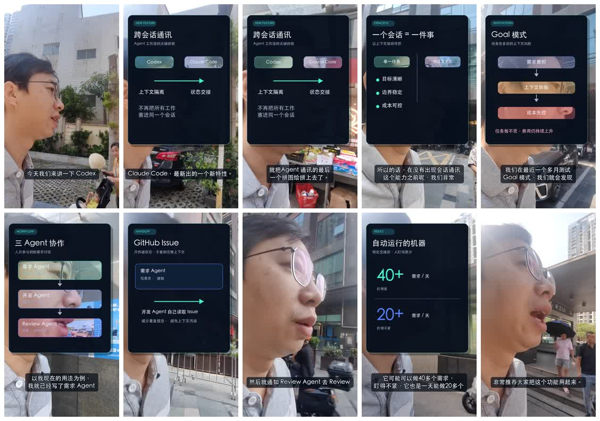
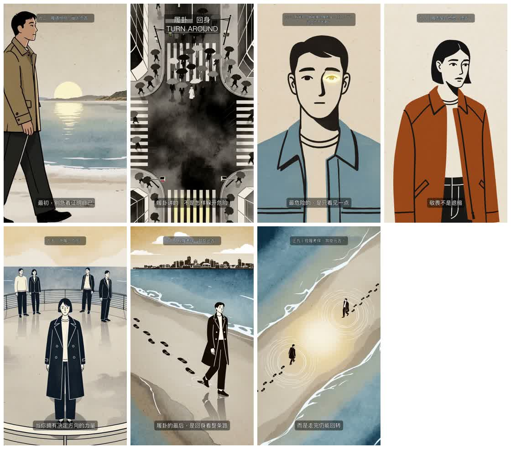
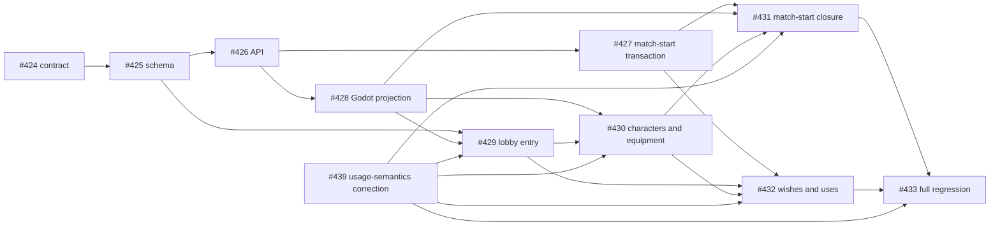

<div align="center">

# Akasha Grimoire

**Turn successful Agent collaboration into reusable team capabilities.**

[](#capability-catalog)
[](#graph-engineering)
[](#)
[](#why-use-it)
[](LICENSE)

[简体中文](README.zh-CN.md) · **English** · [日本語](README.ja.md)

</div>

---

Akasha Grimoire is a team-shared collection of Agent Skills, best used in **Codex App**. It packages task boundaries, tool facts, execution scripts, low-noise waiting, and independent acceptance into installable capabilities so Agents can guess less, avoid repeated polling, and deliver with evidence in real projects. Individual Skills also work with other compatible Agents and CLIs.

> **Want to try image, video, speech, and music generation right away?** Register at [LovBrowser](https://lovbrowser.com) and add credits. Akasha Grimoire connects to `https://newapi.1234bot.com/v1` by default. One new-api key unlocks GPT Image, Grok, Seedance, MiniMax H3, Kling, Gemini Omni, Fish Audio, and Suno without configuring a separate Base URL for each service.

## Get started in one minute

1. In Codex, directly ask GPT Image, Grok, Seedance, MiniMax H3, Kling, Gemini Omni, Fish Audio, or Suno to perform a media task.
2. If no key is available on first use, the Agent generates a LovBrowser device-authorization QR code together with a clickable link and short code.
3. Scan it on your phone, register or sign in, and confirm the same short code. The local client then polls automatically, saves the credential, and verifies it with `/v1/models`.
4. After verification, the original media task resumes once automatically. The real key never passes through the conversation, clipboard, or command arguments.

You can also run `python3 shared/akasha_credentials.py status|start|finish|cancel|rollback` to manage the configuration. Credentials are stored in `~/.config/akasha/credentials.env` by default. Existing environment variables remain supported, with precedence: dedicated variable > `NEW_API_API_KEY` > user credential > `OPENAI_API_KEY`.

## Why use it

- **Contract first**: define triggers, inputs, outputs, exclusions, and completion criteria before execution.
- **Fact driven**: verify CLI versions, arguments, endpoints, and constraints against the current runtime and reliable implementations.
- **Low-noise execution**: delegate fixed polling and mechanical work to scripts, preserving tokens for judgment and Review.
- **Independent acceptance**: a worker's own report never replaces cumulative diff, tests, artifacts, and remote-state verification.
- **Single source of truth**: the repository is the canonical source for shared Skills; install them locally with symbolic links.

## Graph Engineering

Graph Engineering models delivery as a traceable work graph rather than a sequence of disposable prompts:

`Spec → Epic → Issue → Agent Task → Evidence`

| Layer | Responsibility |
| --- | --- |
| **Spec** | Defines goals, boundaries, non-goals, key decisions, and final acceptance as the root contract |
| **Epic** | Decomposes the Spec into a milestone subgraph and organizes cross-Issue dependencies and aggregate acceptance |
| **Issue** | The smallest executable node, with an owner, scope, dependencies, outputs, and verification |
| **Agent Task** | A runtime instance of an Issue in Codex App or an external worker; it does not replace the Issue record |
| **Evidence** | Closes an Issue with diff, tests, artifacts, Review, and remote SHA, then rolls completion up to the Epic and Spec |

All implementation and acceptance work is Issue-driven. Every task maps to an Issue; dependencies are expressed as `depends_on`, `blocks`, `produces`, and `validates` edges; only nodes whose dependencies are satisfied may run in parallel. Direction changes update the Spec/Epic/Issue first, while Evidence rolls completion upward from the leaves. Codex App is the preferred control plane because it exposes tasks, hosts isolated worktrees, supports long bounded waits, and closes the acceptance loop.

## Capability catalog

The repository currently contains **28 Skills**. Install just one or combine them into a complete pipeline spanning content understanding, media generation, editing QA, multi-Agent development, and publishing.

### Recent updates

- **Parallel content distribution**: `multi-platform-video-publishing` unifies account checks, platform-specific copy, uploads, ledgers, and remote verification across Douyin, Xiaohongshu, Bilibili, and WeChat Channels.
- **Event-driven multi-Agent work**: `agent-task-supervisor` and `codex-app-development` now use a two-layer structure; isolated workers are accepted as soon as each finishes, while the supervising task independently reviews diffs and reruns risk-based verification.
- **Asynchronous GitHub pipeline**: `github-issue-pipeline` connects requirements, development, and Review roles through Issues, labels, comments, and PRs.
- **UI benchmarking and visual convergence**: `ui-ux-imitation-development` drives interface changes with same-viewport screenshots, translucent overlays, and difference hotspots.
- **Expanded video capabilities**: new or improved support for Gemini Omni video editing, Seedance last-frame continuation, H3/Kling game promos, WeChat Channels talking-head editing, and second-by-second directing prompts.
- **Remotion finishing engine**: `remotion-video-production` standardizes video-shotcraft shot recipes, exact demos, a traceable SFX manifest, deterministic rendering, and independent final Review.

### Credentials and entry point

| Skill | Use case | Core capabilities |
| --- | --- | --- |
| [`akasha-key-setup`](skills/akasha-key-setup/) | First use of a media Skill or new-api credential management | LovBrowser device authorization, local key storage, connectivity verification, cancellation, and rollback |

### Coordination and governance

| Skill | Use case | Core capabilities |
| --- | --- | --- |
| [`agent-task-supervisor`](skills/agent-task-supervisor/) | Supervise multiple tasks with a Spec/Epic/Issue graph | Two-layer task structure, dependency scheduling, isolated workers, per-task cursors, accept-first-on-finish, and independent Evidence checks |
| [`github-issue-pipeline`](skills/github-issue-pipeline/) | Advance multi-task development asynchronously through GitHub | Epic/Issue creation, ready-Issue dispatch, PR Review, label/comment state machine, and merge closure |

### Content production

| Skill | Use case | Core capabilities |
| --- | --- | --- |
| [`content-pipeline`](skills/content-pipeline/) | Turn Chinese ideas, articles, or source material into a Xiaohongshu-style image-post package | Content contract, source research, copy, content map, HTML/CSS cards, optional image generation, and mobile QA |

`content-pipeline` alone can produce text-only HTML/CSS cards. To generate photos or illustrations, also install `gpt-image-generation` and `akasha-key-setup`.

### Video production

| Skill | Use case | Core capabilities |
| --- | --- | --- |
| [`video-production`](skills/video-production/) | Produce a complete video from an idea, article, script, or existing media | Select Remotion or a video model first, then orchestrate direction, assets, finishing, and QA |
| [`remotion-video-production`](skills/remotion-video-production/) | Code animation, interface demos, photo/copy choreography, and recoverable Remotion videos | video-shotcraft shot recipes, exact demos, on-demand SFX, dual-version rendering, and specialized acceptance |
| [`video-director`](skills/video-director/) | Writing, directing, storyboards, and pre-generation planning | Narrative beats, shot coverage, camera movement, continuity bible, and generation plan |
| [`video-source-research`](skills/video-source-research/) | Search, download, and organize B-roll, images, or audio | Per-shot queries, downloads, ffprobe, SHA-256, and traceable `sources.json` |
| [`video-editing`](skills/video-editing/) | General rough/fine cuts, B-roll, sound, subtitles, and export | Reviewable `edl.json`, deterministic FFmpeg rendering, A/V synchronization, and multi-aspect exports |
| [`video-qc`](skills/video-qc/) | Accept generated clips, previews, and finished videos | Full decode, black-frame/freeze/silence/loudness/subtitle checks, representative frames, and continuity Review |
| [`wechat-channels-talking-head`](skills/wechat-channels-talking-head/) | Edit WeChat Channels monologues, interviews, and explainers | Semantic rough cut, word-level subtitles from the final audio, info cards/PiP, cover, publishing package, and anti-overcut verification |
| [`article-to-short-video`](skills/article-to-short-video/) | Turn a Chinese long-form article or opinion piece into a 60–120 second vertical video | Evidence boundaries, narration compression, dynamic shots, Fish voiceover, Suno music, and vertical-video acceptance |
| [`seedance-video-generation`](skills/seedance-video-generation/) | Seedance text-to-video, image-to-video, first/last-frame, and multi-reference generation | Second-by-second directing prompts, model-level constraints, asynchronous polling, safe downloads, and output probing |
| [`seedance-video-continuation`](skills/seedance-video-continuation/) | Continue from the final frame of an existing MP4 | Last-valid-frame extraction, first-frame continuation, continuity prompting, segment concatenation, and re-verification |
| [`h3-kling-video-generation`](skills/h3-kling-video-generation/) | MiniMax H3 and Kling shots and game promos | T2V/I2V, director-style prompts, 2D animation/MG/UI composition, model validation, and MP4 downloads |
| [`gemini-omni-video-generation`](skills/gemini-omni-video-generation/) | Gemini Omni video generation and editing | Continue from public media or past tasks, job polling, MP4 validation, and unexpected-audio diagnosis |
| [`multi-platform-video-publishing`](skills/multi-platform-video-publishing/) | Publish accepted videos to four platforms | Parallel account checks and uploads, platform-specific copy, SHA duplicate prevention, ledgers, remote-state verification, and recovery |

When no finishing engine is specified, `video-production` first asks whether to use Remotion or a video model; an explicit request for Remotion, video-shotcraft, or a specific video model routes directly to that path. The video-model path chooses H3, Grok, or Seedance according to shot requirements; still visuals, narration, and music route to GPT Image, Fish Audio, and Suno respectively. Web video downloads additionally require `yt-dlp`, deterministic editing and QA require FFmpeg/ffprobe, and production distribution requires a signed-in `mpau` runtime.

### Image, game, and audio

| Skill | Use case | Core capabilities |
| --- | --- | --- |
| [`game-asset-forge`](skills/game-asset-forge/) | Characters, scenes, UI, icons, tilesets, sprites, and animation frames | Asset contracts, smoke-before-batch, alpha/halo checks, character consistency, animation loops, and engine-import acceptance |
| [`gpt-image-generation`](skills/gpt-image-generation/) | GPT Image or Gemini reference-based image generation/editing | Generations/edits, multi-reference composition, safe persistence, real format/dimension validation, and endpoint diagnosis |
| [`grok-media-generation`](skills/grok-media-generation/) | Grok image/video generation and editing | Stable/preview endpoints, image editing, video-job polling, result parsing, and real-file acceptance |
| [`fish-audio-speech`](skills/fish-audio-speech/) | TTS, STT, voice search/cloning, and character voices | Public/private voices, emotion control, per-character binding, timestamped transcription, and audio persistence |
| [`suno-music-generation`](skills/suno-music-generation/) | Songs, lyrics, or instrumental music | Asynchronous jobs, silent local polling, multi-candidate audio/cover downloads, and per-item acceptance |

### App subtasks and CLI development workers

Code development uses a two-layer loop by default: **the supervising task defines the requirements contract and acceptance criteria → an isolated Codex App worker plans autonomously, implements with TDD, and self-tests → the supervising task independently reviews the cumulative diff, reruns risk-based verification, and completes Git delivery**. Parallel workers use isolated worktrees and per-task cursors; each is accepted immediately when it finishes, without waiting for the rest of the batch. Only when the user explicitly requests a CLI TUI worker does the flow switch to three layers: Epic supervision → Issue ownership/acceptance → CLI developer.

| Skill | Worker / use case | Characteristics |
| --- | --- | --- |
| [`codex-app-development`](skills/codex-app-development/) | Default code-development worker | GPT-5.6 Sol, difficulty-based thinking, isolated worktree, Red → Green → Refactor, and independent diff Review |
| [`claude-code-cli-development`](skills/claude-code-cli-development/) | User requests Claude Code | Visible Terminal + tmux, status/delivery files, same-session rework, and parent acceptance |
| [`codex-cli-development`](skills/codex-cli-development/) | User requests Codex CLI/TUI | Planning, Red gate, implementation, Review, and rework in one interactive session |
| [`gemini-cli-development`](skills/gemini-cli-development/) | User requests Gemini CLI | Frontend and general development, visible TUI, status delivery, and independent acceptance |
| [`grok-cli-development`](skills/grok-cli-development/) | User requests Grok CLI | Bounded small code/UI tasks plus visual and video concepts |
| [`ui-ux-imitation-development`](skills/ui-ux-imitation-development/) | Align an existing UI with a reference product | Same-viewport reference/current screenshots, overlay differences, scope confirmation, modification, and screenshot re-verification |

## Case study 1: `lov-talk`—turn a casual six-minute monologue into a publishable video

*Cross-Session Communication and Agent Workflows* began as a phone recording carrying a 90° display rotation. The Agent first built a semantic map, then compressed 365.424 seconds into 309.566 seconds—not by mechanically cutting on silence, but by preserving the complete argument: “new feature → old problem → Goal-mode counterexample → three-Agent workflow → capacity conclusion.”

[](docs/assets/lov-talk-agent-workflow-preview.mp4)

[▶ Play or download the 32-second talking-head preview](docs/assets/lov-talk-agent-workflow-preview.mp4) (four eight-second excerpts from the opening, Goal mode, three-Agent workflow, and capacity conclusion; finished audio preserved)

| Stage | Capabilities used | Reproducible result |
| --- | --- | --- |
| Semantic edit | `wechat-channels-talking-head` + `video-editing` | One full-length baseline clip became 39 semantic clips, with `cut-plan.csv`, `edl.json`, and an applicable patch |
| Information enhancement | `wechat-channels-talking-head` | Seven explanatory info cards while preserving the speaker frame and subtitle safe area |
| Subtitles and sound | Final A-roll alignment + FFmpeg | 75 word-level subtitles and dialogue-sidechained music; no overlap, negative duration, or out-of-range cue |
| Final acceptance | `video-qc` | 1080 × 1920, 30 fps, H.264/AAC; full decode passed, -15.69 LUFS, True Peak -0.98 dBTP |
| Recoverable delivery | Patch + rollback + SHA-256 | Modified version rebuildable; rollback copy hash matches the source |

The key rule captured by this case is: **lock the semantics and final audio before adding subtitles and visual enhancements**. Otherwise subtitles drift with intermediate versions, or context essential to the argument gets cut in pursuit of “faster pacing.”

## Case study 2: `lov-anime`—the 75-second 2D animation *Lü Hexagram · Turning Back*

Animation production is not “one prompt, one finished film.” `lov-anime` first froze the content and visual contracts, accepted character/scene anchors and difficult-shot smokes, then generated six stylistically consistent segments in batch, and finally completed Fish Audio female narration, Suno music, subtitles, mixing, and the publishing package.

[](docs/assets/lov-anime-lugua-75s-preview.mp4)

[▶ Play or download the complete compressed 75-second preview of *Lü Hexagram · Turning Back*](docs/assets/lov-anime-lugua-75s-preview.mp4) (540 × 960, 24 fps, H.264/AAC, with female narration and music)

| Stage | Capabilities used | Reproducible result |
| --- | --- | --- |
| Direction and consistency | `video-director` + `h3-kling-video-generation` | Content/visual contracts, six-segment directing plan, anchor and difficult-shot smokes, and per-shot QA |
| Voice and music | `fish-audio-speech` + `suno-music-generation` | Separate female narration, instrumental BGM, voice-selection record, and candidate acceptance |
| Edit and mix | `video-editing` | Persistent 1.5 dB carve at 2.5 kHz; music does not dynamically duck with narration, while dialogue remains clear |
| Final acceptance | `video-qc` | 75 seconds, 1080 × 1920, 24 fps, 1,800 frames; -16.0 LUFS, True Peak -2.0 dBFS, full decode passed, zero black frames |
| Publishing package and fallback | `video-editing` + executable rollback | Two cover specifications, subtitles, manifest, SHA-256, publishing copy, and executable rollback; ready for four-platform distribution after acceptance |

This workflow suits educational animation, brand shorts, and AI music videos: use the smallest possible smoke set to expose character drift, uncontrollable shots, and audio masking before scaling generation.

## Case study 3: `mahjong-game`—schedule multi-Agent development with an Issue graph

[Mahjong King](https://github.com/lov-team/mahjong-game) decomposes a large Godot project into `Spec → Epic → Issue → Agent Task → Evidence`. For E10, “Personal Space, Inventory, and Match Loadout,” [#424](https://github.com/lov-team/mahjong-game/issues/424)–[#433](https://github.com/lov-team/mahjong-game/issues/433) form a directed acyclic graph across the product contract, schema, control-plane API, match-start deduction transaction, Godot projection, lobby/character pages, and full regression. These leaf Issues were completed in sequence from 2026-08-06 through 2026-08-09.



Multi-Agent collaboration is not “opening many chat windows at once.” It follows four scheduling constraints:

1. `agent-task-supervisor` starts only ready Issues whose hard dependencies are satisfied, and excludes file-level soft conflicts before dispatch.
2. Every `codex-app-development` worker uses an isolated task/worktree and autonomously completes planning, TDD, implementation, and self-testing.
3. Multiple workers are awaited through per-task cursors; whichever finishes first is reviewed first, with no batch polling and no fast task waiting for a slow one.
4. The parent never accepts a worker's self-report as evidence. It independently checks the cumulative diff, tests, artifacts, PR, and remote SHA; P0–P2 findings return to the original worker for rework.

E11, “Shared Charge Meter and Ultimate Moves,” demonstrates fork/join further: [#449](https://github.com/lov-team/mahjong-game/issues/449) unlocks #450/#451 simultaneously, after which energy, protocol, items, and abilities for 12 characters advance in parallel before joining at HUD, AI/simulation, and [#460 full acceptance](https://github.com/lov-team/mahjong-game/issues/460). This pattern fits long-running projects spanning frontend, backend, protocols, content, and QA.

## Smaller cases: image, video, speech, and music generation

| Goal | Skill combination | Completed example |
| --- | --- | --- |
| Generate/edit images | `gpt-image-generation` / `grok-media-generation` + `game-asset-forge` | [Mahjong King #230](https://github.com/lov-team/mahjong-game/issues/230) confirmed briefs and a small sample batch for 12 original characters before bulk portrait generation, then verified Godot imports, 12 `portrait_path` entries, serialization, and a negative audit for legacy IP |
| Generate video | `seedance-video-generation` + `seedance-video-continuation` | [The Team Behind One Egg, 60 seconds](docs/cases/fanjingshan-eggs-behind-team.md) combines four 15-second Seedance 2.0 vertical animations, using real tail video and foreground occlusion to preserve continuity |
| Generate speech | `fish-audio-speech` | Selected a Chinese female voice for *Lü Hexagram · Turning Back*, generated segmented TTS, assembled 75 seconds of narration, and checked intelligibility by listening back with STT/CER |
| Generate songs/music | `suno-music-generation` | Generated the *Turning Back* song and instrumental BGM, then ran ffprobe, full decode, loudness, silence, and SHA-256 acceptance on each downloaded candidate |


[](docs/assets/fanjingshan-eggs-behind-team-60s.mp4)

[▶ Play or download the 60-second *The Team Behind One Egg*](docs/assets/fanjingshan-eggs-behind-team-60s.mp4)

The shared rule for media generation is: **smoke one item before batching; save the raw response and task ID before downloading; finally inspect the real file instead of treating an API “success” response as delivery.**

## Quick installation

After cloning the repository, prefer symbolic-link installation so the repository remains the single source of truth.

```bash
git clone git@github.com:lov-team/akasha-grimoire.git
cd akasha-grimoire
```

Install one Skill:

```bash
skill_name="suno-music-generation"
skills_home="${CODEX_HOME:-$HOME/.codex}/skills"
mkdir -p "$skills_home"
ln -s "$PWD/skills/$skill_name" "$skills_home/$skill_name"
```

Install all Skills while preserving existing targets:

```bash
skills_home="${CODEX_HOME:-$HOME/.codex}/skills"
mkdir -p "$skills_home"

for skill_dir in "$PWD"/skills/*; do
  skill_name="$(basename "$skill_dir")"
  target="$skills_home/$skill_name"
  if [ -e "$target" ] || [ -L "$target" ]; then
    echo "Preserving existing target: $target"
  else
    ln -s "$skill_dir" "$target"
  fi
done
```

Do not force-overwrite an existing target. Audit the difference first and preserve unknown content in a recoverable form.

## Example prompts

Name the Skill directly in Codex:

```text
Use $agent-task-supervisor to supervise these tasks with low noise and independently accept them after delivery.

Use $agent-task-supervisor to decompose this Spec into an Epic/Issue dependency graph, start only ready Issues in Codex App, and close the graph bottom-up with Evidence.

Use $codex-app-development to create an isolated GPT-5.6 Sol worker with thinking selected by task difficulty. Let the worker plan autonomously, implement with TDD, and self-test; have the current task independently Review the cumulative diff and return P0–P2 findings to the original session.

Use $github-issue-pipeline to decompose this Epic into dependent GitHub Issues, periodically dispatch ready Issues, accept the corresponding PRs, then merge them and close the Issues.

Use $content-pipeline to turn this Chinese article into a Xiaohongshu image-post set, preserve its meaning, confirm the cover direction first, and deliver a recoverable local package.

Use $video-production to turn this product idea into a 30-second vertical video. I have not selected a production path, so first ask whether to use Remotion or a video model.

Use $remotion-video-production and the bundled video-shotcraft recipes to turn these photos and captions into a 30-second vertical video, delivering a recoverable project, two audio versions, keyframes, and QA.

Use $wechat-channels-talking-head to edit this phone monologue into a WeChat Channels video: build the semantic map and anti-overcut rough cut first, then generate subtitles, info cards, cover, and publishing package from the final audio.

Use $seedance-video-continuation to generate the next segment from the last valid frame of this MP4, preserve the character, scene, and camera direction, concatenate it, and recheck the seam.

Use $video-source-research to find B-roll for this shot list, download the selected assets, and output sources.json with ffprobe metadata and SHA-256.

Use $game-asset-forge to create transparent-background character animation frames for a 2D game, smoke one first, then generate the batch.

Use $grok-media-generation to generate or edit this image/video and accept the actual downloaded file.

Use $suno-music-generation to generate music from this song description and download every candidate.

Use $fish-audio-speech to synthesize this narration and inspect the beginning, middle, and end.

Use $multi-platform-video-publishing to distribute this accepted animation to Douyin, Xiaohongshu, Bilibili, and WeChat Channels; adapt the copy per platform, save the ledger, and verify remote status.

Use $ui-ux-imitation-development to align the current interface with this reference image: capture both at the same viewport, analyze overlay differences, modify, and verify convergence with another screenshot.
```

## Credentials and runtime

| Capability | Configuration source | Contract |
| --- | --- | --- |
| Default new-api | `https://newapi.1234bot.com/v1` | No Base URL configuration required; recharge ticket signing also supports the official `llmapi.lovbrowser.com` and `llmapi-direct.lovbrowser.com` entry points; use `NEW_API_BASE_URL` or `--base-url` only for private deployments |
| GPT Image | `IMAGE_PROXY_API_KEY`, `NEW_API_API_KEY`, or `OPENAI_API_KEY` | Never place keys in command arguments, prompts, logs, or the repository |
| Grok / Seedance / H3 / Kling / Gemini Omni | Dedicated key, `NEW_API_API_KEY`, or `OPENAI_API_KEY` | Real calls are billed; run one smoke before expanding the task |
| Suno / Fish Audio | `NEW_API_API_KEY` or `OPENAI_API_KEY` | Real calls consume credits; basic tests do not call external services |
| Official proactive / low-balance recharge | Run `python3 shared/akasha_recharge.py` to create a payment session; choose the amount on the LovBrowser page | Proactive recharge does not require a low balance; official new-api only; the Agent returns only the clickable `publicPageUrl`, shows no QR code, and never leaks keys or tickets |
| Two-layer Codex App tasks | Supervising task plus an isolated Sol worker task/worktree with difficulty-based thinking | Supervisor sends the contract; worker plans and implements autonomously; supervisor independently accepts the full diff. Only CLI TUI workers retain three layers |
| CLI worker | Corresponding locally installed CLI, macOS Terminal, and tmux | Recheck `--version` and `--help` on first use or after a version change |
| Video editing and sourcing | FFmpeg/ffprobe; yt-dlp additionally for web downloads | On macOS use `brew install ffmpeg yt-dlp`; after download, probe the media and record its source and hash |

## Validation

Every Skill includes standard frontmatter and `agents/openai.yaml`. At minimum, run the following after changes:

```bash
validator="${CODEX_HOME:-$HOME/.codex}/skills/.system/skill-creator/scripts/quick_validate.py"
for skill_dir in skills/*; do
  python3 "$validator" "$skill_dir"
done

git diff --check
```

New scripts also require syntax checks and side-effect-free behavioral tests. For image, music, speech, video, or external writes, start with a local fake service or a limited smoke test. Explicitly disclose any capability that has not been verified end to end.

## Structure and maintenance

```text
skills/<skill-name>/
├── SKILL.md              # Trigger description and core work contract
├── agents/openai.yaml    # Agent UI metadata
├── scripts/              # Repeatable, deterministic execution logic (optional)
├── references/           # Tool facts and specialized contracts (optional)
└── assets/               # Templates and resources copied into deliverables (optional)
```

- Keep Skill bodies concise and progressively disclose complex facts one level down in `references/`.
- Do not add READMEs, changelogs, caches, or process summaries inside Skill directories.
- When CLI/API contracts change, recheck the real version, help output, schema, and reliable implementation.
- Before final delivery, read the cumulative diff and scan for TODOs, credentials, local absolute paths, caches, and generated artifacts.
- After push, verify the local SHA, remote SHA, and critical file contents.

## License

The current release uses the [Apache License 2.0 with Additional Commercial Conditions](LICENSE): non-commercial-payment use follows the Apache 2.0 terms; commercial payment use in production is free up to USD 1,000,000 in cumulative payment volume and requires a written commercial license before exceeding that threshold. This combined license is not the unmodified Apache License 2.0. See [Licensing](LICENSING.md) for full details and [COMMERCIAL-LICENSE.md](COMMERCIAL-LICENSE.md) for the Chinese commercial conditions.

Releases previously distributed under GPLv3 remain under their original license.

---

<div align="center">

**Make Agent capability more than a single conversation: make it a verifiable, reusable, evolving work system.**

</div>
