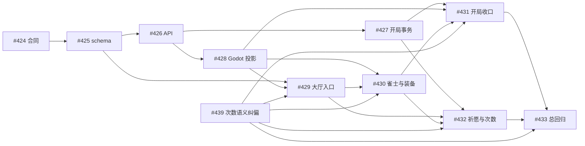

<div align="center">

# Akasha Grimoire · 阿卡夏秘典

**把一次成功的 Agent 协作，沉淀成团队可以反复调用的能力。**

[](#能力目录)
[](#graph-engineering)
[](#)
[](#为什么使用)
[](LICENSE)

**简体中文** · [English](README.md) · [日本語](README.ja.md)

</div>

---

Akasha Grimoire 是团队共享的 Agent Skill 合集，最佳使用环境是 **Codex App**。它把任务边界、工具事实、执行脚本、低噪声等待和独立验收组织成可安装的能力包，让 Agent 在真实项目中少猜、少重复轮询，并用证据完成交付。其他兼容 Agent 与 CLI 仍可使用其中的独立 Skill。

> **想直接体验图片、视频、语音和音乐生成？** 访问 [LovBrowser](https://lovbrowser.com) 注册账号并开通额度。阿卡夏秘典默认连接 `https://newapi.1234bot.com/v1`，拿到一把 new-api Key 后即可调用 GPT Image、Grok、Seedance、MiniMax H3、Kling、Gemini Omni、Fish Audio 与 Suno，无需逐项配置 Base URL。

## 一分钟开通

1. 在 Codex 中直接要求 GPT Image、Grok、Seedance、MiniMax H3、Kling、Gemini Omni、Fish Audio 或 Suno 执行媒体任务。
2. Agent 会先用媒体 Skill 自己配置或默认的 URL，通过 `/v1/models` 验证本机已有的 `OPENAI_API_KEY`；可用就直接复用 Key，不读取 `OPENAI_BASE_URL`。
3. 本地 OpenAI Key 不可用时，Agent 再验证统一的 `LOVBROWSER_API_KEY` 与用户凭证；媒体专用 Key 不参与。共享配置也不可用时才生成 LovBrowser 设备授权二维码，并同时显示可点击链接与短码。
4. 用手机扫码，注册或登录后确认同一短码；本机随后自动轮询、保存、验证，并让最初的媒体任务继续一次。真实 Key 不经过对话、剪贴板或命令参数。

也可运行 `python3 shared/akasha_credentials.py status|start|finish|cancel|rollback` 管理配置。凭证默认保存到 `~/.config/akasha/credentials.env`。运行时按“本地 `OPENAI_API_KEY` > `LOVBROWSER_API_KEY` > 用户凭证 > 配置引导”逐项验证并降级，所有媒体 Skill 共用同一 Key。

存量 `NEW_API_API_KEY` 与媒体专用 Key 仍作为低优先级兼容来源；新配置统一使用 `LOVBROWSER_API_KEY`。旧版 `credentials.env` 会在首次读取时自动改写字段名并保留 0600 权限的 `.bak` 备份。

## 为什么使用

- **合同优先**：先明确触发条件、输入输出、禁止项和完成标准。
- **事实驱动**：CLI 版本、参数、端点和限制以当前运行环境及可靠实现为准。
- **低噪声执行**：把固定轮询和机械动作交给脚本，保留 token 给判断与 Review。
- **独立验收**：worker 自述不能替代累计 diff、测试、产物和远端事实核查。
- **唯一事实源**：仓库是通用 Skill 的唯一来源，本地通过符号链接安装。

## Graph Engineering

Graph Engineering 把交付建模为一张可追踪的工作图，而不是一串临时 prompt：

`Spec → Epic → Issue → Agent Task → Evidence`

| 层级 | 职责 |
| --- | --- |
| **Spec** | 定义目标、边界、非目标、关键决策和最终验收，作为根合同 |
| **Epic** | 把 Spec 拆成里程碑子图，组织跨 Issue 依赖和汇总验收 |
| **Issue** | 最小可执行节点，包含 owner、范围、依赖、输出与验证 |
| **Agent Task** | Issue 在 Codex App 或外部 worker 中的运行实例，不替代 Issue 事实 |
| **Evidence** | 用 diff、测试、产物、Review 与远端 SHA 关闭 Issue，并向上关闭 Epic 和 Spec |

所有需要实施和验收的工作都由 Issue 驱动。任务必须映射到 Issue；依赖以 `depends_on`、`blocks`、`produces`、`validates` 关系边表达；只有依赖已满足的节点才能并行。方向变化先更新 Spec/Epic/Issue，完成状态则按 Evidence 自底向上汇总。Codex App 负责展示任务、承载隔离 worktree、长等待与验收闭环，因此是这套方法的首选控制平面。

## 能力目录

仓库当前包含 **28 个 Skill**。可以只安装一个，也可以组合成从内容理解、媒体生成、剪辑 QA 到多 Agent 开发和发布的完整流水线。

### 最近更新

- **并行内容分发**：`multi-platform-video-publishing` 统一抖音、小红书、B站和视频号的账号校验、平台化文案、上传、台账与远端核验。
- **事件驱动多 Agent**：`agent-task-supervisor` 与 `codex-app-development` 已收敛为两层结构；多个隔离 worker 先完成先验收，主任务独立审阅 diff 和复跑风险验证。
- **GitHub 异步流水线**：`github-issue-pipeline` 用 Issue、label、comment 和 PR 串起需求、开发与 Review 三种异步角色。
- **UI 对标与视觉收敛**：`ui-ux-imitation-development` 用同视口截图、半透明叠加和差异热区驱动界面修改。
- **视频能力扩展**：新增/增强 Gemini Omni 视频编辑、Seedance 尾帧续拍、H3/Kling 游戏 PV、视频号口播以及秒级导演提示词。
- **Remotion 成片引擎**：`remotion-video-production` 固化 video-shotcraft 镜头卡、准确 Demo、可追溯 SFX 清单、确定性渲染和独立终检。

### 凭证与入口

| Skill | 适用场景 | 核心能力 |
| --- | --- | --- |
| [`akasha-key-setup`](skills/akasha-key-setup/) | 首次使用媒体 Skill 或管理 new-api 凭证 | LovBrowser 设备授权、Key 本地保存、连通性验证、取消与回滚 |

### 协作与治理

| Skill | 适用场景 | 核心能力 |
| --- | --- | --- |
| [`agent-task-supervisor`](skills/agent-task-supervisor/) | 用 Spec/Epic/Issue 图谱监工多个任务 | 两层任务结构、依赖调度、隔离 worker、逐任务 cursor、先完成先验收与独立 Evidence 核查 |
| [`github-issue-pipeline`](skills/github-issue-pipeline/) | 通过 GitHub 异步推进多任务开发 | Epic/Issue 创建、ready Issue 派发、PR Review、label/comment 状态机与合并闭环 |

### 内容生产

| Skill | 适用场景 | 核心能力 |
| --- | --- | --- |
| [`content-pipeline`](skills/content-pipeline/) | 把中文想法、文章或资料制作成小红书式图文内容包 | 内容合同、来源研究、文案、内容地图、HTML/CSS 卡片、按需生图和移动端 QA |

单独安装 `content-pipeline` 可完成纯文字 HTML/CSS 卡片；需要生成照片或插画时，同时安装 `gpt-image-generation` 和 `akasha-key-setup`。

### 视频生产

| Skill | 适用场景 | 核心能力 |
| --- | --- | --- |
| [`video-production`](skills/video-production/) | 从创意、文章、脚本或已有素材生产完整视频 | 先选择 Remotion 或视频大模型，再编排编导、素材、成片与 QA |
| [`remotion-video-production`](skills/remotion-video-production/) | 代码动画、界面演示、图文/照片编排和可恢复 Remotion 成片 | video-shotcraft 镜头语法、准确 Demo、按需 SFX、双版渲染和专项验收 |
| [`video-director`](skills/video-director/) | 编剧、导演、分镜和生成前规划 | 叙事节拍、镜头覆盖、摄影运动、连续性 Bible 和生成计划 |
| [`video-source-research`](skills/video-source-research/) | 搜索、下载和整理 B-roll、图片或音频 | 逐镜查询、下载、ffprobe、SHA-256 和可追溯 `sources.json` |
| [`video-editing`](skills/video-editing/) | 通用粗剪、精剪、B-roll、声音、字幕和导出 | 可审阅 `edl.json`、确定性 FFmpeg 渲染、音画同步和多画幅导出 |
| [`video-qc`](skills/video-qc/) | 生成片段、预览和成片验收 | 完整解码、黑帧/冻结/静音/响度/字幕、代表帧与连续性审阅 |
| [`wechat-channels-talking-head`](skills/wechat-channels-talking-head/) | 剪辑视频号口播、采访和知识讲解 | 语义粗剪、最终音轨逐字字幕、信息卡/画中画、封面、发布包与防过剪复验 |
| [`article-to-short-video`](skills/article-to-short-video/) | 把中文长文或观点稿制作成 60—120 秒竖屏短视频 | 证据边界、旁白压缩、动态镜头、Fish 配音、Suno 配乐和竖屏验收 |
| [`seedance-video-generation`](skills/seedance-video-generation/) | Seedance 文生、图生、首尾帧和多参考视频 | 秒级导演提示、模型级约束、异步轮询、安全下载和成片探测 |
| [`seedance-video-continuation`](skills/seedance-video-continuation/) | 从已有 MP4 尾帧继续生成 | 最后有效帧提取、首帧续拍、连续性提示、分段拼接与复验 |
| [`h3-kling-video-generation`](skills/h3-kling-video-generation/) | MiniMax H3、Kling 镜头和游戏 PV | T2V/I2V、导演式 Prompt、二维动画/MG/UI 合成、模型校验和 MP4 下载 |
| [`gemini-omni-video-generation`](skills/gemini-omni-video-generation/) | Gemini Omni 视频生成与视频编辑 | 公开素材/历史任务续接、任务轮询、MP4 校验和意外音轨诊断 |
| [`multi-platform-video-publishing`](skills/multi-platform-video-publishing/) | 将已验收成片发布到四个平台 | 并行账号校验与上传、平台化文案、SHA 防重、台账、远端状态核验与恢复 |

未指定成片引擎时，`video-production` 先询问 Remotion 或视频大模型；明确点名 Remotion、video-shotcraft 或具体视频模型时直接进入对应路线。视频大模型路线按镜头需求选择 H3、Grok 或 Seedance；静态视觉、旁白和音乐分别路由到 GPT Image、Fish Audio 与 Suno。网页视频下载额外需要 `yt-dlp`，确定性剪辑和 QA 需要 FFmpeg/ffprobe；正式分发需要已登录的 `mpau` 运行时。

### 图像、游戏与音频

| Skill | 适用场景 | 核心能力 |
| --- | --- | --- |
| [`game-asset-forge`](skills/game-asset-forge/) | 角色、场景、UI、图标、Tileset、Sprite 和动画帧 | 资产合同、先 smoke 后批量、透明度/halo、角色一致性、动画循环和引擎导入验收 |
| [`gpt-image-generation`](skills/gpt-image-generation/) | GPT Image 或 Gemini 参考图生图/改图 | generations/edits、多参考合成、安全落盘、真实格式/像素校验和端点诊断 |
| [`grok-media-generation`](skills/grok-media-generation/) | Grok 图片/视频生成与编辑 | 稳定版/预览版端点、图片编辑、视频任务轮询、结果解析和真实文件验收 |
| [`fish-audio-speech`](skills/fish-audio-speech/) | TTS、STT、声线搜索/克隆与角色配音 | 公开/私人声线、情感控制、逐角色绑定、时间戳转写和音频落盘 |
| [`suno-music-generation`](skills/suno-music-generation/) | 歌曲、歌词或纯音乐生成 | 异步任务、本地静默轮询、多候选音频/封面下载和逐项验收 |

### App 子任务与 CLI 开发 worker

默认代码开发采用两层闭环：**监工任务定义需求合同与验收条件 → 创建隔离 Codex App worker 自主计划、TDD 实现和自测 → 监工任务独立审阅累计 diff、复跑必要验证并完成 Git 交付**。并行 worker 使用独立 worktree 和逐任务 cursor，任一任务完成后立即验收，不等待同批其他任务。用户点名 CLI TUI worker 时，才切换为 Epic 监工 → Issue 负责/验收 → CLI developer 三层分工。

| Skill | Worker / 场景 | 特点 |
| --- | --- | --- |
| [`codex-app-development`](skills/codex-app-development/) | 默认代码开发 worker | GPT-5.6 Sol、按难度选择 thinking、隔离 worktree、Red → Green → Refactor、独立 diff Review |
| [`claude-code-cli-development`](skills/claude-code-cli-development/) | 用户指定 Claude Code | 可见 Terminal + tmux、状态/交付文件、同会话返工与父层验收 |
| [`codex-cli-development`](skills/codex-cli-development/) | 用户指定 Codex CLI/TUI | 单一交互会话中的计划、Red 门、实现、Review 与返工 |
| [`gemini-cli-development`](skills/gemini-cli-development/) | 用户指定 Gemini CLI | 前端与通用开发、可见 TUI、状态交付和独立验收 |
| [`grok-cli-development`](skills/grok-cli-development/) | 用户指定 Grok CLI | 边界明确的小型代码/UI 任务，也可生成视觉与视频概念 |
| [`ui-ux-imitation-development`](skills/ui-ux-imitation-development/) | 让现有界面对齐参考产品 | 参考/现状同视口截图、叠加差异、范围确认、修改和复截图验证 |

## 案例一：`lov-talk`——把 6 分钟随手口播剪成可发布成片

《跨会话通讯与 Agent 工作流》从一段带 90° 显示旋转的手机原片开始。Agent 先做语义地图，再把 365.424 秒素材压缩为 309.566 秒；不是按静音机械切割，而是保留“新特性 → 旧问题 → Goal 模式反例 → 三 Agent 工作流 → 产能结论”的完整论证链。

[](docs/assets/lov-talk-agent-workflow-preview.mp4)

[▶ 播放或下载 32 秒口播剪辑预览](docs/assets/lov-talk-agent-workflow-preview.mp4)（从开场、Goal 模式、三 Agent 工作流和产能结论四处各取 8 秒；保留成片声音）

| 环节 | 使用能力 | 可复验结果 |
| --- | --- | --- |
| 语义剪辑 | `wechat-channels-talking-head` + `video-editing` | 1 个全长基线片段变为 39 个语义片段，输出 `cut-plan.csv`、`edl.json` 与可应用 patch |
| 信息增强 | `wechat-channels-talking-head` | 7 张解释型信息卡，保持人物主画面与字幕安全区 |
| 字幕与声音 | 最终 A-roll 音轨对齐 + FFmpeg | 75 条逐字字幕、对白侧链配乐；字幕无重叠、负时长或越界 |
| 成片验收 | `video-qc` | 1080 × 1920、30 fps、H.264/AAC；完整解码通过，-15.69 LUFS，True Peak -0.98 dBTP |
| 可恢复交付 | Patch + rollback + SHA-256 | 修改版可重建；回滚副本与原片哈希一致 |

这个案例沉淀出的关键规则是：**先锁定语义与最终音轨，再做字幕和视觉增强**。否则字幕会跟中间版本漂移，或为了“节奏快”剪掉论证所需的上下文。

## 案例二：`lov-anime`——《履卦·回身》75 秒二维动画

动画生产不是“一条 Prompt 出片”。`lov-anime` 先冻结内容合同和视觉合同，验收角色/场景锚点与困难镜头 smoke，再批量生成六段统一风格镜头，最后完成 Fish Audio 女声讲解、Suno 音乐、字幕、混音和发布包。

[](docs/assets/lov-anime-lugua-75s-preview.mp4)

[▶ 播放或下载《履卦·回身》75 秒完整压缩预览](docs/assets/lov-anime-lugua-75s-preview.mp4)（540 × 960、24 fps、H.264/AAC，保留女声讲解和音乐）

| 环节 | 使用能力 | 可复验结果 |
| --- | --- | --- |
| 编导与一致性 | `video-director` + `h3-kling-video-generation` | 内容/视觉合同、六段导演计划、锚点与困难镜头 smoke、逐镜 QA |
| 配音与配乐 | `fish-audio-speech` + `suno-music-generation` | 独立女声旁白、纯器乐 BGM、声线选择记录与候选验收 |
| 剪辑与混音 | `video-editing` | 2.5 kHz 常驻让位 1.5 dB，音乐不随旁白动态闪避；对白仍清晰 |
| 成片验收 | `video-qc` | 75 秒、1080 × 1920、24 fps、1800 帧；-16.0 LUFS、True Peak -2.0 dBFS、完整解码通过、黑帧 0 |
| 发布包与回退 | `video-editing` + 可执行 rollback | 双规格封面、字幕、manifest、SHA-256、发布文案与可执行回退；验收后可继续交给四平台分发 Skill |

这套流程适合知识动画、品牌短片和 AI MV：先用最少的 smoke 暴露角色漂移、镜头不可控和声音遮蔽问题，再扩大生成规模。

## 案例三：`mahjong-game`——用 Issue 图调度多 Agent 开发

[麻将王](https://github.com/lov-team/mahjong-game) 把大型 Godot 项目拆成 `Spec → Epic → Issue → Agent Task → Evidence`。以 E10“个人空间、背包与出场配置”为例，[#424](https://github.com/lov-team/mahjong-game/issues/424)—[#433](https://github.com/lov-team/mahjong-game/issues/433) 将产品合同、schema、control-plane API、开局扣次事务、Godot 投影、大厅/雀士页和总回归组成有向无环图；这些叶子 Issue 已在 2026-08-06 至 2026-08-09 依次完成。



多 Agent 协作不是“同时开很多聊天框”，而是遵守四条调度约束：

1. `agent-task-supervisor` 只启动硬依赖已满足的 ready Issue，并在派发前排除文件级软冲突。
2. 每个 `codex-app-development` worker 使用隔离 task/worktree，自主完成计划、TDD、实现和自测。
3. 多 worker 按逐任务 cursor 等待；谁先完成就先审阅谁，不做整批轮询，也不让快任务等待慢任务。
4. 父层不采信 worker 自述，必须独立检查累计 diff、测试、产物、PR 和远端 SHA；P0—P2 问题发回原 worker 继续返工。

E11“共享充能条与超必杀”进一步展示了 fork/join：[#449](https://github.com/lov-team/mahjong-game/issues/449) 同时解锁 #450/#451，随后并行推进能量、协议、道具和 12 名角色能力，最后在 HUD、AI/模拟和 [#460 总验收](https://github.com/lov-team/mahjong-game/issues/460) 汇合。它适合跨前端、后端、协议、内容与 QA 的长期项目。

## 案例四：生图、生视频、生语音与生歌

| 目标 | Skill 组合 | 已完成样例 |
| --- | --- | --- |
| 生图/改图 | `gpt-image-generation` / `grok-media-generation` + `game-asset-forge` | [麻将王 #230](https://github.com/lov-team/mahjong-game/issues/230) 先确认 12 名原创角色 brief 与小批量样张，再批量生成立绘，并验证 Godot import、12 条 `portrait_path`、序列化和旧 IP 负向审计 |
| 生视频 | `seedance-video-generation` + `seedance-video-continuation` | [60 秒《一枚鸡蛋的幕后团队》](docs/cases/fanjingshan-eggs-behind-team.md) 由 4 段 × 15 秒 Seedance 2.0 竖屏动画组成，以真实尾部视频和前景遮挡维持连续性 |
| 生语音 | `fish-audio-speech` | 为《履卦·回身》选择中文女声、分段 TTS、合成 75 秒旁白，并用 STT/CER 回听检查可懂度 |
| 生歌/配乐 | `suno-music-generation` | 生成《回身》歌曲与纯器乐 BGM，多候选下载后逐项执行 ffprobe、完整解码、响度、静音和 SHA-256 验收 |


[](docs/assets/fanjingshan-eggs-behind-team-60s.mp4)

[▶ 播放或下载 60 秒《一枚鸡蛋的幕后团队》](docs/assets/fanjingshan-eggs-behind-team-60s.mp4)

媒体生成的共同原则是：**先单个 smoke，再批量；先保存原始响应与任务 ID，再下载；最后检查真实文件，而不是把接口返回“成功”当成交付完成。**

## 案例五：雪后故宫旧纸手帐——用 Remotion 把图片流程做成视频

“一张普通照片，如何变成旧纸手帐？”这个案例把一张雪后故宫照片到旧纸海报的变化拆成 8 个可读步骤：原图进入、Prompt 编译、主体缩小、扩大留白、纸张做旧、朱红套印、成片揭晓和 Before/After。`remotion-video-production` 负责把操作逻辑、镜头、字幕和声音编排成一支可重复渲染的 35 秒竖屏 Case Film。

https://github.com/user-attachments/assets/96fe95f6-2558-4e70-b03d-bc30fae36372

公开预览为仅 SFX 版本：540 × 960、30 fps、H.264/AAC，保留打字、纸张、套印和滑动音效。

| 环节 | 使用能力 | 可复验结果 |
| --- | --- | --- |
| 叙事与时间线 | `video-director` + `remotion-video-production` | 8 段时间线连续覆盖 0–1049 帧，每段只解释一个视觉变化 |
| 镜头设计 | Remotion 动效编排 | 终端逐字输入、纸片拍定、双色套印和 Before/After 滑动均由代码逐帧控制 |
| 确定性动画 | Remotion 帧号计算 | 1080 × 1920、30 fps、1050 帧；源码不依赖实时日期或非确定性随机数 |
| 声音设计 | 6 个可追溯 SFX | 打字、回车、纸张滑动、剪切、拍定和快速掠过全部按场景起始帧加 offset 钉帧 |
| 成片验收 | `video-qc` | 公开一个仅 SFX 版本；完整解码通过，1050 帧连续，黑帧为 0 |

这个案例沉淀出的关键规则是：**Remotion 负责把素材变化过程讲清楚**。素材可以来自图片生成、视频模型、截图或用户文件；进入时间线后，镜头、字幕、声音、参数和 QA 都保持确定、可检查、可重建。

## 快速安装

克隆仓库后，优先用符号链接安装，让仓库持续充当唯一事实源。

```bash
git clone git@github.com:lov-team/akasha-grimoire.git
cd akasha-grimoire
```

安装单项 Skill：

```bash
skill_name="suno-music-generation"
skills_home="${CODEX_HOME:-$HOME/.codex}/skills"
mkdir -p "$skills_home"
ln -s "$PWD/skills/$skill_name" "$skills_home/$skill_name"
```

安装全部 Skill，并保留已有目标：

```bash
skills_home="${CODEX_HOME:-$HOME/.codex}/skills"
mkdir -p "$skills_home"

for skill_dir in "$PWD"/skills/*; do
  skill_name="$(basename "$skill_dir")"
  target="$skills_home/$skill_name"
  if [ -e "$target" ] || [ -L "$target" ]; then
    echo "保留已有目标：$target"
  else
    ln -s "$skill_dir" "$target"
  fi
done
```

不要使用强制覆盖。若目标已存在，先审计差异，并用可恢复方式保留未知内容。

## 使用示例

在 Codex 中直接点名 Skill：

```text
使用 $agent-task-supervisor 轻量监工这些任务，并在交付后独立验收。

使用 $agent-task-supervisor 把这份 Spec 拆成 Epic/Issue 依赖图，在 Codex App 中只启动已就绪的 Issue，并用证据自底向上关闭整张图。

使用 $codex-app-development 创建 GPT-5.6 Sol、按任务难度选择 thinking 的隔离 worker；让 worker 自主计划、TDD 实现和自测，当前任务独立 Review 累计 diff，并把 P0–P2 发回原会话。

使用 $github-issue-pipeline 把这份 Epic 拆成带依赖的 GitHub Issue；定时派发 ready Issue，验收对应 PR，通过后合并并关闭 Issue。

使用 $content-pipeline 把这篇中文文章制作成一套小红书图文；保留原意，先确认封面方向，最后交付可恢复的本地内容包。

使用 $video-production 把这份产品创意制作成 30 秒竖屏视频；我还没有指定制作路线，请先询问使用 Remotion 还是视频大模型。

使用 $remotion-video-production 和内置 video-shotcraft 镜头卡，把这些照片与文案制作成 30 秒竖屏视频，交付可恢复工程、双版成片、关键帧和 QA。

使用 $wechat-channels-talking-head 把这段手机口播剪成视频号成片：先做语义地图和防过剪粗剪，再按最终音轨生成字幕、信息卡、封面与发布包。

使用 $seedance-video-continuation 从这个 MP4 的最后有效画面继续生成下一段，保持人物、场景和镜头方向一致，拼接后复验接缝。

使用 $video-source-research 为这份镜头表检索 B-roll，下载采用项并输出带 ffprobe 元数据和 SHA-256 的 sources.json。

使用 $game-asset-forge 为 2D 游戏制作一套透明背景角色动画帧，先 smoke 再批量。

使用 $grok-media-generation 生成或编辑这段图片/视频，并验收下载后的真实文件。

使用 $suno-music-generation 根据这段歌曲描述生成音乐，并下载所有候选结果。

使用 $fish-audio-speech 把旁白文本合成为语音，并检查开头、中段和结尾。

使用 $multi-platform-video-publishing 把已验收的动画成片分发到抖音、小红书、B站和视频号；分别适配文案，保存台账并核对远端状态。

使用 $ui-ux-imitation-development 让当前界面对齐这张参考图：同视口截图、叠加分析差异，修改后复截图验证收敛。
```

## 凭证与运行环境

| 能力 | 配置来源 | 约定 |
| --- | --- | --- |
| 默认 new-api | `https://newapi.1234bot.com/v1` | 无需配置 Base URL；充值签票也支持 `llmapi.lovbrowser.com` 与 `llmapi-direct.lovbrowser.com` 官方入口；私有部署才用 `NEW_API_BASE_URL` 或 `--base-url` 覆盖 |
| GPT Image | `LOVBROWSER_API_KEY` 或本地 `OPENAI_API_KEY` | 不把 key 写进命令参数、prompt、日志或仓库 |
| Grok / Seedance / H3 / Kling / Gemini Omni | `LOVBROWSER_API_KEY` 或本地 `OPENAI_API_KEY` | 所有媒体 Skill 共用一把 Key；真实调用会计费，先做单个 smoke |
| Suno / Fish Audio | `LOVBROWSER_API_KEY` 或 `OPENAI_API_KEY` | 真实调用会消耗额度；基础测试不调用外部服务 |
| 官方主动/余额不足充值 | 运行 `python3 shared/akasha_recharge.py` 创建支付会话；金额在 LovBrowser 页面选择 | 主动充值不需要余额不足；仅官方 new-api；Agent 只给出可点击的 `publicPageUrl`，不显示二维码；不泄露 Key/票据 |
| Codex App 两层任务 | 监工 task、Sol 按难度选择 thinking 的隔离 worker task/worktree | 监工下发合同；worker 自主计划和实现；监工独立验收完整 diff。仅 CLI TUI worker 保留三层分工 |
| CLI worker | 本机已安装的对应 CLI、macOS Terminal、tmux | 首次使用或版本变化时重新核对 `--version` 与 `--help` |
| 视频剪辑与素材 | FFmpeg/ffprobe；网页下载另需 yt-dlp | macOS 可使用 `brew install ffmpeg yt-dlp`；下载后仍必须探测媒体并记录来源与哈希 |

## 验证

每个 Skill 都包含标准 frontmatter 和 `agents/openai.yaml`。修改后至少运行：

```bash
validator="${CODEX_HOME:-$HOME/.codex}/skills/.system/skill-creator/scripts/quick_validate.py"
for skill_dir in skills/*; do
  python3 "$validator" "$skill_dir"
done

git diff --check
```

新增脚本还必须执行语法检查和无副作用行为测试。涉及生图、音乐、语音、视频或外部写入时，默认先使用本地假服务或 smoke；未真实端到端验证的能力必须明确披露。

## 目录与维护

```text
skills/<skill-name>/
├── SKILL.md              # 触发描述与核心工作合同
├── agents/openai.yaml    # Agent UI 元数据
├── scripts/              # 可重复、确定性的执行逻辑（按需）
├── references/           # 工具事实与专项合同（按需）
└── assets/               # 可复制到交付物中的模板与资源（按需）
```

- Skill 正文保持简洁，复杂事实放到一层 `references/` 中渐进披露。
- 不在 Skill 目录加入 README、变更日志、缓存或过程总结。
- 修改 CLI/API 合同时重新核对真实版本、帮助信息、schema 和可靠实现。
- 正式交付前通读累计 diff，检查 TODO、凭证、本机绝对路径、缓存和生成产物。
- 推送后核对本地 SHA、远端 SHA 和关键文件内容。

## 许可证

当前版本采用 [Apache License 2.0 + 附加商业条件](LICENSE)：非商业支付使用按 Apache 2.0 条款授权；生产环境中的商业支付使用，累计支付总额不超过 1,000,000 美元（USD 1,000,000）免费，超过前须取得书面商业授权。该组合许可证不是未经修改的 Apache License 2.0。完整说明见 [授权说明](LICENSING.md)，中文商业条件见 [COMMERCIAL-LICENSE.md](COMMERCIAL-LICENSE.md)。

此前按 GPLv3 发布的版本仍适用原许可证。

---

<div align="center">

**让 Agent 的能力不只存在于一次会话，而成为团队可以验证、复用和进化的工作系统。**

</div>
